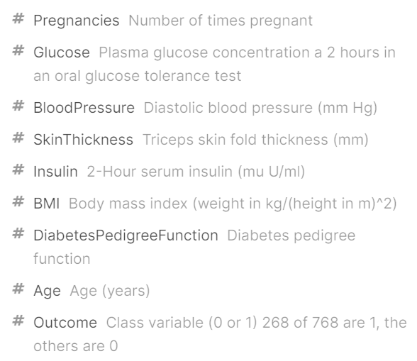

```{r setup, echo=FALSE,warning=FALSE,message=FALSE,include=FALSE}
knitr::opts_chunk$set(echo = TRUE)
```
 
```{r, echo=FALSE,warning=FALSE,message=FALSE,include=FALSE}
#plotting and exploring
library(tidyverse) #for plotting and summarizing
library(GGally) #for nice scatterplot matrix 
library(ggridges) #for joy/ridge plots
library(corrplot) #for basic correlation matrix plot
library(naniar) #for exploring missing values
library(pdp) #for partial dependence plots, MARS models
library(rpart.plot) #for plotting decision trees
library(vip) #for importance plots
library(pROC) #for ROC curves
library(plotROC) #for plotting ROC curves

#making things look nice
library(lubridate) #for nice dates
library(knitr) #for nice tables
library(scales) #for nice labels on graphs
library(gridExtra) #for arranging plots
library(broom) #for nice model output
library(janitor) #for nice names

#data
library(ISLR) #for data
library(moderndive) #for data
library(rattle) #weather data

#modeling
library(rsample) #for splitting data
library(recipes) #for keeping track of transformations
library(caret) #for modeling
library(leaps) #for variable selection
library(glmnet) #for LASSO
library(earth) #for MARS models
library(rpart) #for decision trees
library(randomForest) #for bagging and random forests

theme_set(theme_minimal())
```

## Introduction

Our dataset is obtained from Kaggle.com. The goal is to predict whether or not the diagnostic measurements such as their blood pressure, BMI, and age have affect on the occurence of diabetes. In our data, all patient are females at least 21 years old of Pima Indian heritage. An accurate description of variables is provided in the image below.

Our dataset is obtained from Kaggle.com. The goal is to predict whether or not the patients have diabetes based on diagnostic measurements such as their blood pressure, BMI, and age. All patient are females at least 21 years old of Pima Indian heritage. An accurate description of variables is provided in the image below.



# Data cleaning

```{r, echo=FALSE,warning=FALSE,message=FALSE,include=FALSE}
db <- read_csv("diabetes.csv")
```

We notice that there might be some missing values because it does not make sense to have blood pressure of 0 or BMI of 0. Variables requiring modifications include BMI, BloodPressure, Glucose, Insulin, and SkinThickness, all of which containe values of 0 but should always be higher than 0. Therefore, we use the mutate function to first change these 0 values into NA.

```{r}
db <- db %>%
  mutate(BMI=ifelse(BMI==0, NA, BMI),
         BloodPressure=ifelse(BloodPressure==0, NA, BloodPressure),
         Glucose=ifelse(Glucose==0, NA, Glucose),
         Insulin=ifelse(Insulin==0, NA, Insulin),
         SkinThickness=ifelse(SkinThickness==0, NA, SkinThickness))

summary(db)
```

From the summary table above, we can see that there are some NA's in Glucose, BloodPressure, and BMI, but there are hundred of NA's in SkinThickness and Insulin. Therefore, we decide to change NA's to the median value for Glucose, BloodPressure, and BMI, and make SkinThickness and Insulin categorical.In addition, we cannot tell whether a zero pregnancy means no pregnancy experience or a missing value, so we decided to treat all zero pregnancy as no pregnancy experience.

```{r, echo=FALSE,warning=FALSE,message=FALSE,include=TRUE, fig.width=12, fig.height=12}
db%>% 
  select_if(is.numeric)%>%
  pivot_longer(cols = everything(),
               names_to = "variable", values_to = "value") %>% 
  ggplot(aes(x = value)) +
  geom_histogram() +
  facet_wrap(vars(variable), scales = "free")
```

The above are graphs that summarize all the 9 variables. We can see that all the predictor variables are numerical while the outcome variable is categorical, with 0 meaning that the patient does not have diabetes and 1 meaning that the patient has diabetes. Four of the predictor variables, BloodPressure, BMI, Glucose, and SkinThickness, are approximately normally distributed. The other four variables, Age, DiabetesPedigreeFunction, Insulin, and Pregnancies, are right-skewed, showing the most patients in the dataset are young, have few pregnancies, have low insulin level, and are not likely to have diabetes based on their family history.

We plot the relationship between the outcome variable and all predictor variables as well. For most variables, how they affect the outcome is not appreciable. Age, Pregnancies, and Glucose are the three that have slightly more observable influence on the outcome. From the graph, our primary conjecture is that higher Age, Pregnancies, and Glucose are associated with having diabetes.

```{r, echo=FALSE,warning=FALSE,message=FALSE,include=TRUE, fig.width=12, fig.height=6}
db_bmi<-db%>%
  ggplot(aes(y=BMI, x=as.factor(Outcome)))+
  geom_boxplot()

db_preg<-db%>%
  ggplot(aes(y=Pregnancies,x=as.factor(Outcome)))+
  geom_boxplot()

db_glu<-db%>%
  ggplot(aes(y=Glucose,x=as.factor(Outcome)))+
  geom_boxplot()

db_blood<-db%>%
  ggplot(aes(y=BloodPressure,x=as.factor(Outcome)))+
  geom_boxplot()

db_skin<-db%>%
  ggplot(aes(y=SkinThickness, x=as.factor(Outcome)))+
  geom_boxplot()

db_insu<-db%>%
  ggplot(aes(y=Insulin,x=as.factor(Outcome)))+
  geom_boxplot()

db_dia<-db%>%
  ggplot(aes(y=DiabetesPedigreeFunction,x=as.factor(Outcome)))+
  geom_boxplot()

db_age<-db%>%
  ggplot(aes(y=Age,x=as.factor(Outcome)))+
  geom_boxplot()

grid.arrange(db_age,db_blood, db_bmi, db_dia, db_glu, db_insu, db_preg, db_skin, nrow = 2) 
```

We fail to find information about how to categorize Insulin or SkinThickness online so that we can only do the categorization based on the distribution of our data. Histograms above show how Insulin and SkinThickness are distributed. For SkinThickness, it is approxiately normally distributed with some outliers around 100 while for Insulin, the shape is right-skewed with a peak around 100. Using these graphs and the summary table above, we build our categories: low insulin from 0 to 50, medium insulin from 50 to 200, and high insulin above 200; thin skin from 0 to 30, medium skin from 30 to 70, and thick skin above 70. All the NA's are categorized as missing.

For Glucose, BloodPressure, and BMI, the median values are calculated after changing all 0 values to missing. Then those NA's are mutated to the median value.

```{r, echo=FALSE,warning=FALSE,message=FALSE,include=TRUE}
db <- db %>%
  mutate(BMI=ifelse(is.na(BMI), median(db$BMI,na.rm = TRUE), BMI),
         BloodPressure=ifelse(is.na(BloodPressure), median(db$BloodPressure,na.rm = TRUE), BloodPressure),
         Glucose=ifelse(is.na(Glucose), median(db$Glucose,na.rm = TRUE), Glucose),
         Insulin=ifelse(is.na(Insulin), "Missing", ifelse(Insulin<50, "Low",
                                                          ifelse(Insulin>=50&Insulin<200, "Medium", "High"))),
         SkinThickness=ifelse(is.na(SkinThickness), "Missing",
                              ifelse(SkinThickness<30,"Thin",
                                     ifelse(SkinThickness>=30&SkinThickness<70, "Medium", "Thick"))))
```

We use 70% of the dataset as our training data while 30% as our testing data. The proportion 0.7 is used instead of 0.5 because this dataset, with 768 observations, is not a large dataset and thus a larger proportion is needed to fit an accurate model.

```{r, echo=FALSE,warning=FALSE,message=FALSE,include=TRUE}
set.seed(253)
db_split <- initial_split(db, prop = .7)
db_train <- training(db_split)
db_test <- testing(db_split)
```

## Modeling

### 4-var

First of all, we choose four variable out of all the available variables, and use them to create a logistic model. We decide to choose age, BMI, glucose, and Pregnancies.

#### Fit the model

```{r, echo=FALSE,warning=FALSE,message=FALSE,include=TRUE}
# Set the seed
set.seed(253)
# Run the model
log_four_var <- train(
    as.factor(Outcome) ~ Age+BMI+Glucose+Pregnancies,
    data = db_train,
    method = "glm",
    family = "binomial",
    trControl = trainControl(method = "cv", number = 5),
    metric = "Accuracy",
    na.action = na.omit
)

# Model output
summary(log_four_var) %>% 
  coef() %>% 
  tidy() %>% 
  select(`.rownames`, Estimate) %>% 
  mutate(exp_coef = exp(Estimate))
```

#### Cross-validated accuracy

```{r}
log_four_var$results$Accuracy
```

Then, we calculate the cross-validated accuracy for this four-var model, whichi is 0.7750.

#### Confusion matrix

```{r}
confusionMatrix(data = predict(log_four_var, type = "raw"), #predictions
                reference = as.factor(db_train$Outcome), #actuals
                positive = "1") 
```

We then used the confusion matrix to further evaluate the model. From the confusion matrix, we can see that the model accuracy is 0.7807. Since it is only slightly higher than the cross-validated accuracy, we don't think there is much over-fitting here.

Also, the specificity of 0.8870 is much higher than the sensitivity of 0.5761, which means that this model has a higher true negative rate than true positive rate. It can predict better when the patients don't have diabetes than when the patients have diabetes.

#### ROC curve and the AUC

```{r, echo=FALSE,warning=FALSE,message=FALSE,include=TRUE}
db_train %>% 
  mutate(PredOutcome =  predict(log_four_var, type = "prob")$"1") %>%
  ggplot(aes(d = Outcome, m = PredOutcome)) + 
  geom_roc(labelround = 2, size = 1,
           linealpha = .5, pointalpha = .8) +
  geom_abline(slope = 1, intercept = 0, color = "gray")
  
db_train %>% 
  mutate(PredOutcome=  predict(log_four_var, type = "prob")$"1") %>%
  roc(Outcome, PredOutcome) %>% 
  auc()
```

Then, we plot the ROC curve and compute the AUC for this model, which is 0.8449. From the graph above, we can see that the ROC curve is above the liner line and the area under it is 0.8449, which is much higher than the 0.5 standard.

### all-var

#### Fit the model

```{r, echo=FALSE,warning=FALSE,message=FALSE,include=TRUE}
# Set the seed
set.seed(253)
# Run the model
log_all_var <- train(
    as.factor(Outcome) ~ .,
    data = db_train,
    method = "glm",
    family = "binomial",
    trControl = trainControl(method = "cv", number = 5),
    metric = "Accuracy",
    na.action = na.omit
)
# Model output
summary(log_all_var) %>% 
  coef() %>% 
  tidy() %>% 
  select(`.rownames`, Estimate) %>% 
  mutate(exp_coef = exp(Estimate))
```

Now, instad of looking at only four variables, we want to include all the variables we have and build a model based on them.

#### Cross-validated accuracy

```{r}
log_all_var$results$Accuracy
```

First, we compute the cross-validated accuracy which is 0.7657 for this all-variable model.

#### Confusion matrix

```{r}
confusionMatrix(data = predict(log_all_var, type = "raw"，newdata = db_train), #predictions
                reference = as.factor(db_train$Outcome), #actuals
                positive = "1") 
```

Similarly, we created a confusion matrix to see the model performance. From the matrix, we can see that the model has an accuracy of 0.7788, which is pretty close to the cross-validated accuracy. Similar to the four-var model, the specificity is much higher than the sensitivity, which means that this model has a higher true negative rate than true positive rate. It can predict better when the patients don't have diabetes than when the patients have diabetes

#### ROC curve and the AUC

```{r, echo=FALSE,warning=FALSE,message=FALSE,include=TRUE}
db_train %>% 
  mutate(PredOutcome =  predict(log_all_var, type = "prob"，newdata = db_train)$"1") %>%
  ggplot(aes(d = Outcome, m = PredOutcome)) + 
  geom_roc(labelround = 2, size = 1,
           linealpha = .5, pointalpha = .8) +
  geom_abline(slope = 1, intercept = 0, color = "gray")
#d = actual status, m = predicted probability
db_train %>% 
  mutate(PredOutcome=  predict(log_all_var, type = "prob",newdata = db_train)$"1") %>%
  roc(Outcome, PredOutcome) %>% 
  auc()
```

Now, we drew a ROC curve and compute the AUC for this model. The AUC for this all-var model is 0.8524. It is higher than 0.5 and aove the liner line, so we think the model is doing well from the perspective of AUC.

### Lasso

#### Fit the model

```{r, echo=FALSE,warning=FALSE,message=FALSE,include=TRUE}
set.seed(253)
lambda_grid <- 10^seq(-4, -2, length = 100)
log_lasso <- train(
    as.factor(Outcome) ~ .,
    data = db_train,
    method = "glmnet",
    family = "binomial",
    trControl = trainControl(method = "cv", number = 5),
    tuneGrid = data.frame(alpha = 1, 
                          lambda = 10^seq(-4, -2, length = 100)),
    metric = "Accuracy",
    na.action = na.omit
)

log_lasso$results %>% 
  ggplot(aes(x = lambda, y = Accuracy)) +
  geom_line() +
  scale_x_log10()
```

Other than a four-var model and an all-var model, we want to fit another model using the Lasso method.

#### Cross-validated accuracy

```{r,include=FALSE}
log_lasso$bestTune$lambda
log_lasso$results
```

First of all, we find the best lambda and based on the value of lambda, we find the cross-validated accuracy of 0.7732 for the lasso model.

#### Confusion matrix

```{r}
confusionMatrix(data = predict(log_lasso, 
                               type = "raw",newdata = db_train), #predictions
                reference = as.factor(db_train$Outcome), #actuals
                positive = "1")
```

As same as we did before, we created a consusion matrix for our Lasso model, and got an accuracy of 0.7862. It is very close to our cross-validated accuracy. Also, the specificity is much higher than the sensitivity, which means that this model has a higher true negative rate than true positive rate. It can predict better when the patients don't have diabetes than when the patients have diabetes

#### ROC curve and the AUC

```{r, echo=FALSE,warning=FALSE,message=FALSE,include=TRUE}
db_train %>% 
  mutate(PredOutcome =  predict(log_lasso, type = "prob"，newdata = db_train)$"1") %>%
  ggplot(aes(d = Outcome, m = PredOutcome)) + 
  geom_roc(labelround = 2, size = 1,
           linealpha = .5, pointalpha = .8) +
  geom_abline(slope = 1, intercept = 0, color = "gray")
#d = actual status, m = predicted probability
db_train %>% 
  mutate(PredOutcome=  predict(log_lasso, type = "prob"，newdata = db_train)$"1") %>%
  roc(Outcome, PredOutcome) %>% 
  auc()
```

After drawing the ROC curve and computed the AUC, we found an AUC of 0.8523 for our Lasso model. It shows a great performance since the AUC is higher than our threshold of 0.5.

# Classification tree

#### Fit the model

We also try fitting the model using classification tree method as shown below. Since this is a classification model, the "Accuracy" metric is used to select the optimal model. We use cross-validation method to compute the accuracy. The tuning parameter cp is set to vary from $10^{-5}$ to $10^1$ so that we can find the maximum accuracy. 

```{r}
set.seed(327)

db_tree_model <- train(
  as.factor(Outcome) ~ ., 
  data = db_train,
  method = "rpart",
  tuneGrid = data.frame(cp = 10^seq(-5, 1 , 
                                    length = 50)),
  trControl = trainControl(method = "cv", number = 5),
  metric = "Accuracy",
  na.action = na.omit
)
```

#### Plot of cp versus accuracy 

We also have a plot of our tuning parameter (cp) versus the accuracy below. From this plot, we can see that the best tuning parameter is at the peak where the highest accuracy is. We also notice that as the tuning parameter gets larger than $10^{-1}$, the accuracy drops sharply and the curve has flattened out. 

```{r}
db_tree_model$results %>% 
  ggplot(aes(x = cp, y = Accuracy)) + 
  geom_point() + 
  geom_line() + 
  scale_x_log10()
```

#### Cross-validated accuracy

```{r, echo=FALSE, warning = FALSE, message= FALSE, include=FALSE}
db_tree_model$results
```

```{r}
db_tree_model$bestTune
```
The best tuning paramter is 0.01526418 and the highest accuracy is 0.7548.

#### Confusion matrix

```{r}
confusionMatrix(data = predict(db_tree_model, type = "raw", newdata = db_train), #predictions
                reference = as.factor(db_train$Outcome), #actuals
                positive = "1") 
```

The confusion matrix above shows us that the the sensitivity of this model is 0.7717  and the specificity of it is  0.8701. Since the specificity is higher than the sensitivity, this model has a higher true negative rate than true positive rate. This means that it can predict better when the patients don't have diabetes than when the patients have diabetes. 

The accuracy using the entire training dataset is 0.8364  which is significantly greater than the cross-validated accuracy 0.7548. This could be because the model is overfitted since we use the entire training data set.     

#### ROC curve and the AUC

```{r}
db_train %>% 
  mutate(PredOutcome =  predict(db_tree_model, type = "prob", newdata=db_train)$"1") %>%
  ggplot(aes(d = Outcome, m = PredOutcome)) + 
  geom_roc(labelround = 2, size = 1,
           linealpha = .5, pointalpha = .8) +
  geom_abline(slope = 1, intercept = 0, color = "gray")
```    

```{r, warning=FALSE, message=FALSE}
db_train %>% 
  mutate(PredOutcome =  predict(db_tree_model, type = "prob", newdata = db_train)$"1") %>%
  roc(Outcome ~ PredOutcome, data=.) %>% 
  auc()
```

We also use ROC and AUC method to evaluate our model. We want our classifier to perform better than chance where the AUC is 0.5. From the graph above, we can see that it is doing a pretty good job since the ROC curve is above the linear line and the area under it is 0.8677 which is greater than 0.5. 

#### Plot of tree model 

Below is the plot of our tree model. We notice that Glucose is the most important predictor since it is used for the first split and also a few more splits as we go down the tree. 

```{r}
rpart.plot(db_tree_model$finalModel)
```

# Random forest

#### Fit the model

We also fit the model using random forest method. Similarly to the classification tree model, we use "Accuracy" matric to evaluate our model, and use OOB method to compute the accuracy. What is good about random forest method is that we can randomly choose and limit the number of predictors as candidates at each split. In this model, we vary the mtry parameter from 1 to 8 since we have 8 predictors so that we can select an optimal model.  

```{r, warning=FALSE}
set.seed(327)
db_randf_model <- train(
  as.factor(Outcome) ~ .,
  data = db_train, 
  method = "rf",
  trControl = trainControl(method = "oob"),
  tuneGrid = data.frame(mtry = c(1, 2, 3, 4, 5, 6, 7, 8)),
  ntree = 200, 
  importance = TRUE, #for importance plots later
  nodesize = 5, #this is the default terminal node size for regression trees. Could set larger for smaller trees.
  metric = "Accuracy",
  na.action = na.omit
)
```

#### Plot of mtry vs. accuracy  

Below is the plot of our tuning parmeter "mtry" versus accuracy. We can see that the accuracy is maximized when the tuning parameter is 8. This means the optimal model is obtained when all predictors are chosen as candidates for each split. 
 
```{r}
#Examine the results in a plot
db_randf_model$results %>% 
  ggplot(aes(x = mtry, y = Accuracy)) + 
  geom_point() + 
  geom_line() 
```

#### OOB accuracy

The results table shows the accuracy for each mtry. The highest accuracy is 0.7843 with the best mtry of 8. 

```{r}
db_randf_model$results
db_randf_model$bestTune
```

#### Confusion matrix

```{r}
confusionMatrix(data = predict(db_randf_model, type = "raw"), #predictions
                reference = as.factor(db_train$Outcome), #actuals
                positive = "1") 
``` 

According to the confusion matrix and statistic above, we can see that the sensitivity of this model is 0.6141 and the speficity is 0.8446. Similarly to the classification model tree, the specificity rate is higher than the sensitivity rate, thus this model predicts better when the patients don't have diabetes than when they have diabetes. We also notice that the accuracy using the entire data set is 0.7658 which is lower than the oob accuracy 0.7843. 

#### ROC curve and the AUC
 
```{r}
db_train %>% 
  mutate(PredOutcome =  predict(db_randf_model, type = "prob")$"1") %>%
  ggplot(aes(d = Outcome, m = PredOutcome)) + 
  geom_roc(labelround = 2, size = 1,
           linealpha = .5, pointalpha = .8) +
  geom_abline(slope = 1, intercept = 0, color = "gray")
```    

```{r, message=FALSE}
db_train %>% 
  mutate(PredOutcome =  predict(db_randf_model, type = "prob")$"1") %>%
  roc(Outcome ~ PredOutcome, data=.) %>% 
  auc()
```

We also use ROC and AUC to evaluate this model. The ROC curve is above the linear line indicating that it performs better than chance. As mentioned above, we want the area under the curve to be close to 1 and greater than 0.5. The AUC from this model is 0.8157.    

#### Variable importance plot

```{r,warning=FALSE}
vip(db_randf_model$finalModel, num_features = 8, bar = FALSE) 
```

We also plot the variable importance plot. It is clear that glucose is the most important predictor. Age and BMI are the most important predictors after glucose.  

# Summary-train

               |4-var        |all-var      |Lasso        |Class. Tree  |Rand. Forest
    -----------|-------------|-------------|-------------|-------------|-------------
    Accuracy   |0.7750[4]    |0.7713[2]    |0.7732[3]    |0.7547[1]    |0.7843[5] 
    AUC        |0.8449[2]    |0.8524[4]    |0.8523[3]    |0.8677[5]    |0.8157[1]  

Baed on the summary table above, it is hard to conclude which model is the best. The model with the highest accuracy has the smallest AUC while the one with the highest AUC has the lowest accuracy. Therefore, it is the best to choose the model with the median accuracy and AUC. The all-var model and the Lasso model may be the best two as all their AUCs are higher than 0.85 while the 4-var model's does not.

## Applying to test data

After we fit all five models using the training data, we are going to examine the effect of each model on the test data. We primarily focus on the accuracy and the AUC value, and use statistics from the confusion matrix (including sensitivity and specificity) as references.

### 4-var

We get an accuracy of 0.7435 and an AUC of 0.8166 for this model.

```{r, echo=FALSE,warning=FALSE,message=FALSE,include=FALSE}
confusionMatrix(data = predict(log_four_var, newdata = db_test, type = "raw"),
                reference = as.factor(db_test$Outcome),
                positive = "1") 
```

```{r, echo=FALSE,warning=FALSE,message=FALSE}
db_test%>%
  mutate(pred = predict(log_four_var,newdata=db_test,type="prob")$"1")%>%
  roc(as.numeric(db_test$Outcome)~pred,data=.) %>%
  auc()
```

### all-var

We get an accuracy of 0.7391 and an AUC of 0.8249 for this model. The accuracy is lower Than the one of 4-var model while the AUC is slightly larger.

```{r, echo=FALSE,warning=FALSE,message=FALSE,include=FALSE}
confusionMatrix(data = predict(log_all_var, newdata = db_test, type = "raw"),
                reference = as.factor(db_test$Outcome),
                positive = "1") 
```

```{r, echo=FALSE,warning=FALSE,message=FALSE}
db_test%>%
  mutate(pred = predict(log_all_var,newdata=db_test,type="prob")$"1")%>%
  roc(as.numeric(db_test$Outcome)~pred,data=.) %>%
  auc()
```

### Lasso

We get an accuracy of 0.7304 and an AUC of 0.8249 for this model. The accuracy is the lowest of all while the AUC is the same of the one of the all-var model, larger than of 4-var model.

```{r, echo=FALSE,warning=FALSE,message=FALSE,include=FALSE}
confusionMatrix(data = predict(log_lasso, newdata = db_test, type = "raw"),
                reference = as.factor(db_test$Outcome),
                positive = "1") 
```

```{r, echo=FALSE,warning=FALSE,message=FALSE}
db_test%>%
  mutate(pred = predict(log_lasso,newdata=db_test,type="prob")$"1")%>%
  roc(as.numeric(db_test$Outcome)~pred,data=.) %>%
  auc()
```

### Classification tree

We get an accuracy of 0.6957 and an AUC of 0.7519 for this model. Both values are the lowest of all models, indicating that this model is the least accurate and worst one.

```{r, echo=FALSE,warning=FALSE,message=FALSE,include=FALSE}
confusionMatrix(data = predict(db_tree_model, newdata = db_test, type = "raw"),
                reference = as.factor(db_test$Outcome),
                positive = "1") 
```

```{r, echo=FALSE,warning=FALSE,message=FALSE}
db_test%>%
  mutate(pred = predict(db_tree_model,newdata=db_test,type="prob")$"1")%>%
  roc(as.numeric(db_test$Outcome)~pred,data=.) %>%
  auc()
```

### Random forest

We get an accuracy of 0.7217 and an AUC of 0.8048 for this model. It has the second smallest AUC and the third smallest accuracy.

```{r, echo=FALSE,warning=FALSE,message=FALSE,include=FALSE}
confusionMatrix(data = predict(db_randf_model, newdata = db_test, type = "raw"),
                reference = as.factor(db_test$Outcome),
                positive = "1") 
```

```{r, echo=FALSE,warning=FALSE,message=FALSE}
db_test%>%
  mutate(pred = predict(db_randf_model,newdata=db_test,type="prob")$"1")%>%
  roc(as.numeric(db_test$Outcome)~pred,data=.) %>%
  auc()
```

# Summary-test

               |4-var        |all-var      |Lasso        |Class. Tree  |Rand. Forest
    -----------|-------------|-------------|-------------|-------------|-------------
    Accuracy   |0.7435[5]    |0.7391[4]    |0.7304[2]    |0.6957[1]    |0.7217[3] 
    AUC        |0.8166[3]    |0.8249[4]    |0.8249[4]    |0.7519[1]    |0.8048[2]  

According to the summary table above, the all-variable model and the 4-var model are our best choices. Both of them are also not computationally too complicated as there are only eight predictor values in total and thus both are feasible.

## Conclusion

Considering both the training summary table and the testing one leads to our final choice: the all-var model. As a result, our conclusion is that we should include all variables in the model when examing whether a patient has diabetes or not.
